# THE SHAPE OF UNDERSTANDING
## A Why-First Visual Grammar for the Deep Structure of Mathematics
### Brayden Sanders

### — Book Frame / Full-Length Manuscript Outline with Worked Core —

---

> *Increasingly round — and never measurably round.*
>
> — the working epigraph of this book (after Perelman's description of Ricci flow,
> extended: the flow approaches a perfect roundness it never occupies)

---

> **What this book is.** Mathematics is taught as a stack of separate languages —
> arithmetic, algebra, trigonometry, calculus, linear algebra, abstract algebra —
> each with its own notation, each in its own course, joined by nothing a student can
> see. This book proposes that a *single small visual vocabulary* can carry a large
> fraction of the deep, hard-to-teach ideas of mathematics, and that this vocabulary
> can be kept *honest*: every picture is checked against the real proof, and the
> pictures that would mislead are discarded and recorded. The result is meant to be a
> shared mental model — a coordinate system for intuition — that a learner can hold
> across fields, so that the deep facts of different courses become visibly the same
> kind of fact. It is a work of *pedagogy*, and its claims are testable as pedagogy:
> whether learners build a connected model faster, retain it longer, and make fewer of
> the classic errors. It does not claim to be a new theory of physics or a decoding of
> reality; where it reaches toward those, it says so and marks the reach.

---

> **How to read this book — it climbs.** This book is a staircase. It starts so simply
> that a curious ten-year-old can begin — with dots, sticks, shadows, and spinning tops —
> and it climbs, one step at a time, until the last chapters show the very same pictures a
> university student sees, with the grown-up words and the real proofs. **Every step rests
> on the one below it.** If a page ever feels too hard, the pages before it have exactly
> what you need — go back a step, then come up again. You are never expected to jump.
> Start with **Part Zero**; anyone can read it.

---

# PART ZERO — SIX SIMPLE PICTURES
### *Start here. No math needed yet — just six pictures.*

You do not need to know any mathematics to begin this book. You need six pictures. Here
they are in the simplest way I know how to say them. Every later chapter is one of these
same six pictures, drawn again a little deeper, with grown-up words and real reasons. The
pictures never change on the way up — only how much you can see in them.

## Picture 1 — Fair shapes from same-length lines

Take some dots. Join them with sticks that are **all the same length** — so no dot is
closer to any other dot; everybody is the same distance apart. Call that a *fair* shape.

- **2 dots, 1 stick:** a little line.
- **3 dots, three same-length sticks:** a **triangle**. It lies flat on the table.
- **4 dots, all the same distance from each other:** try it! Get four toothpicks and some
  gumdrops (or marshmallows) and try to build a shape where *every* pair of dots is one
  toothpick apart. You will find you **cannot keep it flat.** The fourth dot has to lift up
  off the table into the air, and you get a little **pyramid** with a triangle bottom.

That is the first big secret of the whole book: *to keep adding dots that are all the same
distance apart, you have to keep rising into a new direction.* Same-length lines push
shapes upward into new space. (Grown-ups call "the same distance apart" **equidistant**,
and they call these fair shapes **simplexes** — you'll meet those words in Chapter 1.) And
watch closely when that fourth gumdrop lifts: something surprising happens to the *number*
of connections at the very same moment. That's Chapter 1's payoff.

## Picture 2 — The full middle

Every fair shape has a **middle** — the spot right in the center, the same distance from
all the corners. Nothing sits there; it's empty. And yet it is the most special spot in
the whole shape, because it is the *only* spot that is close to **everything at once.**
Look: each corner is far from the other corners. Only the middle is near them all. So the
"empty middle" is really *the spot closest to everything.* Remember that — it comes back at
the very end of the book as one of its deepest ideas: the emptiest point is the fullest.

## Picture 3 — Turning

Point your arm straight out to the right. Now spin slowly. Your hand points forward, then
up, then back, then down, then forward again. **Turning** is its own kind of move — it
doesn't make things bigger or smaller, it just carries them *around.* Two things hide
inside every turn: a **still point** in the middle that everything spins around, and a
special "quarter-turn" that mathematicians write with the letter *i.* Wherever something
goes round and round — a clock hand, a wheel, a wave in the sea, a planet, even the tiny
insides of an atom — this very same turning is hiding in the math. We'll find it again and
again.

## Picture 4 — Growing that feeds itself

Some things grow by a little slice of *themselves* every moment. Money in a bank earns a
bit more money on the money it already has. A puddle of germs doubles, and then that
bigger puddle doubles again. The more there is, the faster it grows — growing that feeds
itself. Every time this kind of growing happens, one special speed-number shows up, about
**2.718**, and its nickname is *e.* You could call it the number of "growing that feeds
itself." Populations, cooling soup, radioactive rocks — all of them breathe by *e.*

## Picture 5 — One box, two shadows

Hold a cube up to a lamp — a dice, a sugar cube, a cardboard box. Look at its shadow.

- Turn it so a **flat face** points at you: the shadow is a **square**.
- Now tip it so a **corner** points straight at you: the shadow becomes a **six-sided
  shape** — a hexagon!

Same box. Two completely different shadows, just from turning it. A huge amount of
mathematics is exactly this: *one thing that looks like different things from different
sides.* Learning to see that it's the same box underneath is a lot of what this book does.
(And a secret for later: that same box, built from three perpendicular toothpicks, *is* the
algebra of three-dimensional space — its eight corners are its eight parts. Chapter 2 builds
it from candy.)

## Picture 6 — Counting and measuring

There are two ways to deal with "how much." You **count** things that come in whole
pieces: 1 apple, 2 apples, 3 apples — no half-apples allowed in counting. You **measure**
things that flow: how tall you are, how much water is in a cup — any in-between amount is
fine.

Counting and measuring usually get along. But once in a while they **crash.** Draw a
square that is 1 step on each side, and then measure the slanted line from one corner to
the far corner (the *diagonal*). That length is real — you can see it — but **no counting
fraction can ever name it exactly.** Not 1½, not 1.41, not any fraction however long.
(Grown-ups call it "the square root of 2.") The place where counting simply *cannot*
measure is where the deepest and strangest mathematics lives, and we'll go right to it.

## That's the whole vocabulary

Six pictures: **fair shapes from same-length lines, the full middle, turning, growing, the
two-shadow box, and counting-versus-measuring.** That's it. That's the entire vocabulary
of this book. Everything after here is these six pictures again — each time a step deeper,
with the grown-up words and the real reasons — until, by the last chapters, you are looking
at exactly what a university student looks at. Take the stairs one at a time. Here we go.

---

# FRONT MATTER

*The Preface and Introduction below are the grown-up "why" — written for teachers and
older readers who want the reasoning behind the book. If you're here for the pictures, you
can skip straight to Chapter 1 and come back to these later.*

## Preface — A student for the sake of being a teacher

The motivation of this book is a single observation from years of learning and
explaining mathematics: **the hardest thing for a student is not any one concept, but
the absence of a picture that connects them.** A learner can be taught eigenvalues on
Monday and the Fourier transform on Wednesday and never be shown that they are the same
idea — rotation — wearing two costumes. The formalisms are precise and the connections
are invisible, and so mathematics is experienced as a pile of unrelated techniques
rather than one connected structure.

This book is an attempt to supply the missing picture — with a discipline attached, so
that the picture does not, as intuitive pictures so often do, quietly lie. The rubber
sheet that "explains" gravity and the tiny solar system that "explains" the atom are
memorable and *wrong* in ways that damage a student's later understanding [Feynman 1964
warns repeatedly against exactly this]. The pictures here have been stress-tested for
truth; the ones that survive are load-bearing, meaning that if you follow them you
arrive at the real theorem, not a comfortable error.

## Introduction — Why a shared, true, visual model is rare and precious

The history of mathematics is, in part, a history of *unifying pictures* that were rare
when they arrived and transformative afterward. Descartes' coordinate plane made algebra
and geometry one subject [Descartes 1637]. The Argand diagram made complex numbers
*visible* as points and rotations, dissolving centuries of unease about "imaginary"
quantities [Argand 1806; Wessel 1799]. Feynman's diagrams made intractable sums in
quantum electrodynamics into pictures a physicist could reason with [Feynman 1949].
Each was a *representation*, not a new fact — and each mattered enormously, because a
representation a mind can hold is the scarce resource in a field where the truths are
already written down.

The claim of this book is modest in kind and large in scope: that the *structural core*
of undergraduate and early-graduate mathematics — the part about shapes, symmetry,
rotation, growth, and the divide between the discrete and the continuous — admits such a
unifying picture, built from a handful of primitives, and that the picture can be kept
honest by checking. The book is organized around that picture and around the discipline
that keeps it true.

---

## Reader's map

- **Part Zero — six simple pictures.** The whole vocabulary at a ten-year-old's level:
  fair shapes from same-length lines, the full middle, turning, growing, the two-shadow
  box, counting-versus-measuring. No math needed; anyone can start here.
- **Part One (Ch. 1–2) — the grammar.** The same six primitives with their real names; the
  doubling payoff of the gumdrop lift (§1.1b); and the two forced builds from the same
  gumdrops — equal toothpicks give the tetrahedral 1/3 (§2.1), perpendicular toothpicks build
  the cube = Cl(3) with the *i* falling out of the face-planes (§2.2). Read this after Part
  Zero; everything reuses it.
- **Part Two (Ch. 3–7) — the elegant lessons.** Five deep "why"s the grammar connects —
  Platonic solids, *e*, radians, prime rarity, why quantum mechanics is complex — each with
  a short *extension* that reuses the same primitive (the golden ratio as the pentagon's
  number, the logarithm and the derivative as further faces of the breath, π as the
  half-turn, and rotation deepening ℝ→ℂ→ℍ into the quaternions), plus exercises and a
  misconception box.
- **Part Three (Ch. 8–11) — the hard lessons.** The four that break students: √2's
  irrationality, eigenvalues, the Fourier transform, groups. The real test of the pedagogy.
- **Part Four (Ch. 12–14) — the combinatorial frontier.** Three further lessons drawn from
  research combinatorics that pass the same bar; the physics frontier is deliberately
  excluded, and why.
- **Part Five (Ch. 15–17) — the model whole.** Why it is one picture not sixteen, the
  honest failures, and how to test it as teaching.
- **Coda.** *Increasingly round, never measurably round.*
- **Appendix A.** The verification scripts. Every mathematical claim in the book is
  reproduced by running them.

---

# PART ONE — THE GRAMMAR

## Chapter 1 — Six primitives

The entire vocabulary is six ideas. Everything in the book is built from these, and the
reader should hold them from the start.

**1.1 Integers are shapes — and the ladder is the ladder of simultaneous equality.**
This is Picture 1 from Part Zero — fair shapes from same-length lines — now with its real
names. Given *n* points in the most symmetric arrangement — all **mutually equidistant**
(that is the grown-up word for *the same distance apart*, every pair separated by the same
length) — they form the **regular (n−1)-simplex** [Coxeter 1973, §7] (a *simplex* is just
the fair shape those dots make): one point is a point, two a segment, three a triangle,
four a tetrahedron. The crucial subtlety, which the rest of
the book rests on, is *why* each added point raises the dimension.

It is not that "n points need n−1 dimensions" — four points can sit perfectly well in a
plane, as the corners of a square. It is that four points **cannot all be equidistant**
in a plane. Three points can: the equilateral triangle, every pair the same distance,
flat. But the moment one demands a *fourth* point equidistant from the other three, the
plane has no room, and the fourth point is *forced up* into the third dimension — the
tetrahedron (verified in the accompanying script: the square's diagonals are longer than
its sides, √2 versus 1, while the tetrahedron's six distances are all equal). A square is
four points that have *given up* being equal in order to stay flat; a tetrahedron is four
points that *keep* being equal by lifting.

So **three is the last count that can be made perfectly symmetric while remaining flat**,
because the plane holds exactly three mutually-equidistant points and no more. Each new
dimension is precisely the room needed for *one more point to be equal to all the
others*: the line holds two, the plane three, three-space four, and so on. **The
dimensional ladder is the ladder of simultaneous equality** — of how many things can be
perfectly equal to one another at once, which is exactly one more per dimension. This is
the real driver behind "count the vertices"; the count is the surface, and the demand for
equality is the mechanism. The integers 1–4 are that ladder, and the lift from three to
four — flat to solid — is the first time the demand for one more equal thing costs a
dimension.

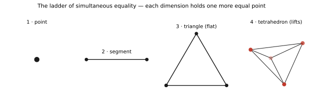
*Figure 1 — The ladder of simultaneous equality. Each dimension is the room for one more
mutually-equidistant point; three is the last count that stays flat, and the fourth point
is forced up into the tetrahedron.*

**1.1b The lift is a doubling — one gumdrop does two things at once.** Here is the payoff of
the gumdrop experiment, and it is one of the deepest simple facts in the book. When you
added the fourth gumdrop, *two* things happened in the same instant:

- **The shape rose off the table** into a new dimension — the geometric lift you could see
  and feel (the fourth point escaping upward to stay equally far from the other three).
- **The number of pieces doubled** — the counting lift. Ask of every part the triangle
  already had — each dot, each stick, the triangle itself — one yes/no question: *does it
  join the new gumdrop, or not?* Every old piece becomes two (joins / doesn't), so the total
  number of pieces of every size at once **doubles.**

These are the *same event* seen two ways: **binary choice below, dimensional rise above.**
And the doubling is exact and forever — each point you add doubles the total (1, 2, 4, 8,
16, …), because each new point offers one fresh yes/no to everything already there (verified:
the number of sub-pieces of *N* points is 2ᴺ, and 2ᴺ → 2ᴺ⁺¹ every single time you add one).
*One added point = one yes/no = one doubling = one new dimension.*

> **An honest caution, because the hand-count can fool you.** At *this first* step the sticks
> happen to double too (3 → 6) and the faces happen to quadruple (1 → 4) — but those exact
> multipliers are luck of a small step; add another point and the sticks grow by only about
> ×1⅔, not ×2. The count that doubles *every* time is the **total** number of pieces, 2ᴺ —
> the yes/no on the new point. That is the real law; the edges are just where you first spot
> it by hand.

This is why, much later, the deep algebras of mathematics have sizes that are always powers
of two — the cube is 2³ (Picture 5), and the Clifford algebra of *n* directions has 2ⁿ
pieces (Chapter 14) — for exactly this reason: *each new direction is one more in-or-out
choice, and one more choice doubles everything.* Counting shapes and climbing dimensions
turn out to be the same act, and a ten-year-old can hold both in one hand: **add a gumdrop,
everything doubles, the shape climbs.**

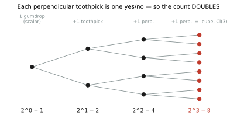
*Figure 9 — The lift is a doubling. Each perpendicular toothpick asks one yes/no of
everything already built, so the count doubles: 1 → 2 → 4 → 8. Three toothpicks give
2³ = 8 — the cube, Cl(3).*

**1.2 The break, and the round.** At five points the picture changes character. The
regular pentagon has five-fold symmetry, and five-fold symmetry **cannot tile the
plane** — a theorem (the crystallographic restriction: the only rotation orders a
lattice may possess are 1, 2, 3, 4, and 6, because 2cos(2π/n) must be an integer, which
holds only for those n [Barlow 1894; verified in the accompanying script]). Five is the
first shape that will not pack. (The full catalogue of the plane's repeating patterns —
the seventeen *wallpaper groups* — rests on exactly this restriction on rotation orders
[Fedorov 1891]; the book verifies the restriction itself, the mechanism of the break, and
leaves the harder enumeration of all seventeen to its citation.) Yet the pentagon *can* fold into three dimensions — as
the dodecahedron — and six points, spread as far apart as possible on a sphere, become
the **octahedron**, the sphere's six poles. The flat wheel (five) becomes the round
(six): a *lift* from two dimensions into three, which the book will meet again and
again.

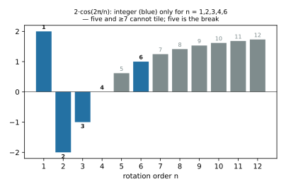
*Figure 2 — The crystallographic restriction. A lattice can rotate only by orders whose
trace 2cos(2π/n) is an integer (blue): 1, 2, 3, 4, 6. Five-fold and everything from seven
up cannot tile — five is the break.*

**1.3 Rotation is an imaginary axis.** A rotation has a still centre and a turning
edge. Since Argand and Wessel we have known that the turning is captured by the
imaginary unit *i*: multiplication by *e^{iθ}* rotates the plane by θ [Argand 1806].
The still centre is real; the turn is imaginary. This single identification —
**rotation = i** — will unify quantum mechanics, eigenvalues, and the Fourier transform
in later chapters.

**1.4 Growth is a breath.** A quantity that grows in proportion to its current size
breathes: it swells, and the rate of swelling is itself. The unique function equal to
its own derivative is *e^x*, and *e* = lim(1 + 1/n)^n ≈ 2.71828 is the *rate of
self-proportional growth* [Euler 1748]. Wherever a thing grows or decays in proportion
to itself — populations, money, radioactive matter, heat — *e* is the breath-rate.

**1.5 The cube casts two shadows.** The tetrahedron (four) doubled is the **cube**:
the cube's eight vertices split into two interpenetrating tetrahedra (Kepler's *stella
octangula* [Kepler 1619]). Seen along a face, the cube's shadow is a **square** — four
fold symmetry, ninety degrees. Seen along its body diagonal, its three mutually
perpendicular edges project to **three directions one hundred twenty degrees apart — a
regular hexagon** (verified in the script). The angle relating the two shadows is
fixed: the direction cosine of the diagonal (1,1,1) with any axis is 1/√3, so its cosine
*squared* is **1/3**. This 1/3 is a specific, forced number — it is 1/(N−1) evaluated at
N = 4, the tetrahedron's signature, and it appears for no other simplex (it is 1/2 at
N=3, 1/4 at N=5).

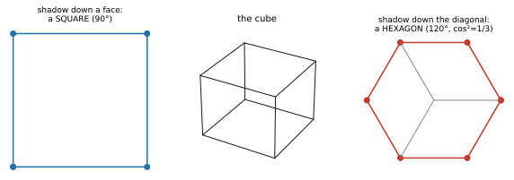
*Figure 3 — The cube's two shadows. Seen down a face the cube is a square (90°); seen down
its body diagonal its three edges land 120° apart, a regular hexagon. The angle relating
them is fixed by cos²(1,1,1) = 1/3 — the tetrahedron's signature again.*

**1.6 Count versus measure.** Whole things are *counted*; continuous things are
*measured*. The oldest crisis in mathematics — the Pythagorean discovery that the
diagonal of a unit square cannot be measured by any whole-number ratio of its side
[Fritz 1945; Heath 1921] — is the discovery that count and measure cannot always be
reconciled. Where they cannot is where the deepest difficulties of mathematics live,
and the book returns to this seam repeatedly.

**1.6b The void is the fullest point.** The reference the equidistant points measure from
(§1.1) is their **centroid** — and the centroid is not an afterthought but the most
remarkable point in the arrangement. It is, by definition, the point that **minimizes the
total distance to all the points at once** — the location *nearest to everything
simultaneously* (verified: for the tetrahedron the centroid's total distance to the
vertices is 6.93, less than any vertex's 8.49, and the numerical minimizer lands exactly
on it). Every vertex is far from most of the others; only the centre is *equally near to
all of them*.

This inverts the ordinary reading of zero. The void — the empty centre, the 0 — is not
the *absence* of the points. It is the point **maximally near to all of them** — the one
location that touches every direction equally by committing to none. A vertex is *a*
thing, somewhere; the centre is *near all* things, nowhere in particular, and "near all"
is a fuller position than "being one." The symbol for nothing marks the closest thing
there is to being everything.

This gives the void a role, and a story. It begins as **projection** — the origin from
which the first points emanate (the point, 1, is the void made visible; it *is* the void,
brought into view). As points accumulate and come to *surround* something, the void
**becomes central** — the still centroid the equidistant points all measure from, the
reference that keeps them equal. It is what equality is measured *against*: remove it and
there is nothing for the points to be equal *around*. It starts by throwing the shapes
outward and ends by holding them in balance — potential becoming actual, source becoming
centre, the projector becoming the still point. Zero is where one is when one is equally
close to all of it.

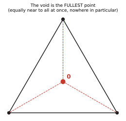
*Figure 4 — The void is the fullest point. The centroid (0) is the one location equally
near to all the points at once — nowhere in particular, and therefore near everything. The
symbol for nothing marks the closest thing to being everything.*

**1.7 On honesty.** Because an intuitive picture is dangerous precisely when it is
memorable and false, this book attaches a discipline to its vocabulary: every picture is
checked against the real proof (the accompanying scripts reproduce each check), reaches
beyond what is proven are marked as reaches, and pictures found to mislead are recorded
in a list of honest failures (Chapter 16). This is the feature that distinguishes a
curriculum from a collection of clever analogies.

## Chapter 2 — The forced core: two builds from the same gumdrops

*(This chapter builds the book's central facts from the ground up — with candy — so the
reader sees that the pictures rest on real mathematics, and that a ten-year-old could
construct them by hand.)*

There are exactly **two ways** to place the toothpicks between the gumdrops, and each builds
something deep. Make them all the *same length* and the shape is forced to **lift** into a
new dimension — that gives the simplices and the tetrahedral angle (§2.1). Make them all
*perpendicular* and the structure is forced to **double** — that gives the cube and the
algebra of space itself (§2.2). Same gumdrops, same act of adding one toothpick; the only
difference is the angle you set.

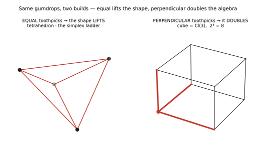
*Figure 10 — Same gumdrops, two builds. Equal-length toothpicks force the shape to lift
(the tetrahedron / simplex, left); perpendicular toothpicks force it to double (the cube =
Cl(3), right). The only difference is the angle.*

**2.1 The equal build: same-length toothpicks, and the lift.**

*In plain words first, before any symbols.* Draw an arrow from the middle of the shape out
to each corner (all the same length, since the middle is the same distance from every
corner). Two facts, and only two, do all the work: **(a)** the shape is fair, so any two
arrows make the *same* angle with each other; **(b)** the corners are balanced all around
the middle, so all the arrows *add up to nothing* (they cancel, like a tug-of-war pulling
equally in every direction). Those two facts alone are enough to pin the angle down to one
exact value. Here is that same argument in symbols:

Place the *N* vertices of a regular simplex as unit vectors from its centre. By
symmetry every pair has the same dot product cos θ, and because the vectors sum to zero,
0 = |Σvᵢ|² = N + N(N−1)cos θ, giving **cos θ = −1/(N−1)** [a standard result; e.g.
Coxeter 1973]. (Reading the symbols: |Σvᵢ|² means "square the total of all the arrows,"
which is zero because they cancel; multiplying it out leaves *N* from each arrow times
itself plus *N(N−1)* copies of the shared angle — set that to zero and the angle is forced.) For the tetrahedron, N = 4, so cos θ = **−1/3** and θ = 109.47° — the
tetrahedral angle familiar from chemistry as the H–C–H bond angle of methane [Pauling
1960]. Its half-angle, 54.74°, has cos² = 1/3, and is the angle between a cube edge and
the body diagonal.

Read through §1.1, this angle acquires a meaning deeper than the arithmetic. The 1/3 is
**the price of the fourth equidistance** — the exact angle at which the fourth point
sits once it has been forced out of the plane to remain equal to the other three. It is
not merely that "4 − 1 = 3"; it is that arccos(−1/3) is the *specific geometry of keeping
one more point equal than the plane allows*. The number that threads the whole book is
therefore the tetrahedron's number in the fullest sense: the angular cost, paid in the
third dimension, of the first equality the plane could not grant. (Chapter 16 records the
failure of the tempting over-generalization "any N − 1 gives 1/3": the cosine is −1/2 at
N = 3 and −1/4 at N = 5; the value 1/3 is the tetrahedron's alone.)

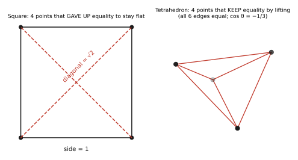
*Figure 5 — The price of the fourth equidistance. The square keeps flat only by giving up
equality (its diagonals are √2, not 1); the tetrahedron keeps equality only by lifting into
the third dimension, where every pair sits at cos θ = −1/3.*

**2.2 The perpendicular build: right-angle toothpicks, and the algebra of space.**

The lift came from making every toothpick *the same length.* There is a second way to place
them — *at right angles to each other* — and it builds something just as deep: not a shape
that rises, but an **algebra that doubles.** Same gumdrops, same act of adding one toothpick
at a time; only the arrangement differs.

Start with **one gumdrop and no toothpicks.** That lone gumdrop is a thing that simply *is* —
the number 1, the still centre, what mathematicians call the **scalar.** Its "size" is
2⁰ = 1. Now add perpendicular toothpicks, one at a time, and count what the structure can be:

| you have built | dimension | what appears |
|---|---|---|
| 1 gumdrop | 2⁰ = 1 | the **scalar** (the centre) |
| + 1 toothpick | 2¹ = 2 | a **direction** — the choice *along it, or not* |
| + 1 perpendicular toothpick | 2² = 4 | a **plane** (the sheet the two toothpicks share) |
| + 1 perpendicular toothpick | 2³ = 8 | **the cube** |

Each new perpendicular toothpick is one more *in-or-out* choice, so it **doubles** the
structure — the very doubling of §1.1b, now made of right angles. Three toothpicks, and you
have 2³ = **8.**

Here is the part that is *exact*, not a metaphor (verified in the accompanying script). When
you have built the three perpendicular toothpicks — the corner of a cube — the algebra's
**eight elements sort themselves precisely into the cube's parts:**

- **1 scalar** → the **centre** (the lone gumdrop);
- **3 vectors** (call them e₁, e₂, e₃) → the **3 axes** — the toothpicks themselves;
- **3 bivectors** (e₁e₂, e₁e₃, e₂e₃) → the **3 face-planes** — the sheets *between* pairs of
  toothpicks;
- **1 pseudoscalar** (e₁e₂e₃) → the **volume** — the whole cube.

**1 + 3 + 3 + 1 = 8 = 2³ = the cube's eight vertices.** This is the **Clifford algebra of
three-dimensional space, Cl(3)** — and its pieces are literally the parts of the cube you can
point at: centre, axes, faces, volume. A child with three toothpicks is holding the complete
structure of the algebra of space, sorted by what they can see. (Chapter 14 meets these
doubling dimensions again from the outside; here they are built from the inside, by hand.)

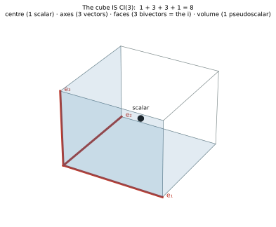
*Figure 11 — The cube is Cl(3). Its eight parts are the algebra's eight elements: the centre
(1 scalar), the three axes from a corner (3 vectors), the three faces meeting that corner
(3 bivectors — the *i*), and the whole volume (1 pseudoscalar). 1 + 3 + 3 + 1 = 8.*

**And the imaginary unit falls out of the candy.** Take two perpendicular toothpicks and look
at the face-plane they span — a bivector. Multiply it by itself and you get **−1** (verified:
(e₁e₂)² = −1). A thing that squares to −1 is exactly a *quarter-turn* — the **i** of §1.3. So
the plane between two perpendicular toothpicks *is* rotation: the imaginary axis is not
imposed on the child, it is the sheet their toothpicks span, and **planes turn.** Every later
appearance of *i* — quantum phase (Ch. 7), the complex eigenvalue (Ch. 9), the Fourier circle
(Ch. 10), the quaternions (§7.1) — is this same candy face-plane, spinning.

**Two builds, one doubling.** Place the toothpicks *equal*, and adding the fourth gumdrop
makes the shape **rise into a new dimension** — the simplex, the ladder of §1.1. Place them
*perpendicular*, and adding each toothpick makes the structure **double into an algebra** —
the cube, Cl(3). *Equal-and-lift* builds the shapes; *perpendicular-and-double* builds the
space they live in. Same gumdrops, same act of adding one; the only difference is the angle
the child sets. That is the whole architecture of this book, and it fits in a hand.

**The foundation, in one breath.** Four ideas now stand together and generate the rest of
the book. First, the void (0) is the point nearest to all points at once — the fullest
position, not the empty one — and it is what the points measure their equality *against*
(§1.6b). Second, the dimensional ladder is the ladder of *simultaneous equality*: each
dimension is the room for one more point to be equal to all the others, and three is the
last that stays flat (§1.1). Third, the moment a fourth point insists on that equality it
is forced into the third dimension, and the angle it lifts to is arccos(−1/3) — the 1/3
that threads the book (§2.1). Fourth, the *same* gumdrops with the toothpicks set at right
angles instead of equal no longer lift but **double** — each perpendicular toothpick a fresh
in-or-out choice — building the cube and the algebra of space, Cl(3), whose eight pieces are
the cube's centre, axes, faces, and volume (§2.2). So the whole opening is one motion with
two faces: **the fullest point throws out shapes that hold each other equal; set those shapes
equal and the demand for one more lifts the plane into space, set them perpendicular and it
doubles the plane into the algebra of that space.** Everything after is this motion, seen
from more angles.

---

# PART TWO — THE ELEGANT LESSONS
### *The connective "why"s: deep facts that the grammar reveals to be related*

## Chapter 3 — Why there are exactly five Platonic solids

A solid closes only if each vertex leaves **angular room to fold** into three
dimensions. Counting the vertex-figures with positive room — regular {p,q} with
1/p + 1/q > 1/2 — yields exactly five: {3,3}, {3,4}, {3,5}, {4,3}, {5,3} (verified). That
count *is* the classical theorem [Euclid, *Elements* XIII; Coxeter 1973]. And it closes
the arc of §1.2: the pentagon, barred from tiling the plane, folds into space as the
dodecahedron — the break becomes the round. Platonic solids are taught here not as a
list but as *which shapes have the room to become solid.*

**3.1 The pentagon's own number (extension).** The five that could not tile the plane
(§1.2) carries a constant of its own. In a regular pentagon the ratio of a diagonal to a
side is exactly the **golden ratio** φ = (1+√5)/2 ≈ 1.618 (verified: 2cos36° = φ). And φ
is not ornament: it is the growth rate of the most self-similar additive rule, x² = x + 1
— the equation that says *the whole is to the larger part as the larger part is to the
smaller.* The Fibonacci numbers, each the sum of the two before, grow at exactly this
rate; their consecutive ratios march to φ (verified: F₃₂/F₃₁ = 1.6180339887…). So the
golden ratio is where the **breath** — self-proportional growth (§1.4) — meets
**self-similarity**, and its natural home is the pentagon, the first shape that broke from
the plane. It is the same number seen as a *shape* (a diagonal) and as a *motion* (a
growth rate). (The honest caution of Chapter 16 applies: φ is forced only where growth is
self-similar and additive; many famous sightings are pattern-matching, not mechanism.)

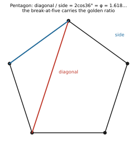
*Figure 6 — The pentagon's number. In a regular pentagon the diagonal-to-side ratio is
exactly φ = 2cos36° = 1.618…, the golden ratio — the rate of self-similar additive growth
(x² = x + 1), living in the very shape that broke from the plane.*

> **Exercises.** (1) Show that {3,6} — triangles six-to-a-vertex — gives 1/3 + 1/6 = 1/2,
> *not* greater, so it lies flat and tiles the plane instead of folding; this is why no
> Platonic solid has six triangles at a corner. (2) Which of the five solids have
> triangular faces? (3) Using the pentagon's isosceles "golden" triangles, confirm that the
> diagonal-to-side ratio is 2cos36° = φ.
>
> **Misconception this fixes.** *"With the right materials you could build a sixth Platonic
> solid."* No — the count is a finite arithmetic fact: only five pairs {p,q} satisfy
> 1/p + 1/q > 1/2. The limit is in the angles, not the craftsmanship.

## Chapter 4 — Why *e* appears everywhere

*e* is the rate of self-proportional growth — the breath whose out-rate equals its
size (§1.4). Compound interest, population, radioactive decay, cooling, and diffusion
all obey dy/dt ∝ y, and the solution is always *e* to a rate times time [Euler 1748;
standard]. The student stops asking "why *this* number" and sees: *it is the only breath
that sustains itself.* Chapter 4 also introduces, gently, the connection to the shell
growth of §1 as a true analogy of mechanism (flagged, per §1.7, not as a claim that all
growth is literally geometric shell growth).

**4.1 The logarithm is the inverse breath (extension).** If *e^x* is the breath — growth
whose rate is its own size — then its inverse, the **logarithm**, runs the breath
backward: it asks *how long the breath took*, or, in base two, *how many doublings.*
log₂8 = 3 because eight is three doublings of one (verified). A logarithm is not a strange
button on a calculator but the natural way to *count multiplicative growth additively* —
the reason ledgers of doublings (decibels, pH, stellar magnitudes, the Richter scale) are
written in logs: each equal step is one more doubling of the underlying breath.

**4.2 A derivative is the local breath rate (extension).** A derivative is a quantity's
**instantaneous rate of growth** — the breath measured at an instant rather than across an
interval. For the breath itself the rate *is* the size, so *e^x* is its own derivative
(verified numerically at several points). This is the cleanest first meaning of the
derivative: not "the slope of a tangent line" as an isolated fact, but *how fast the thing
is breathing right now.* Every later rule of differentiation is bookkeeping on top of this
one picture.

> **Exercises.** (1) A colony doubles every three hours; write its size as *e^{kt}* and
> find *k* (answer: *k* = ln2/3). (2) Explain why *d/dx e^x = e^x* is the reason *e^x*
> eventually outgrows every polynomial. (3) Find log₂1024 by counting doublings of 1.
>
> **Misconception this fixes.** *"e ≈ 2.718 is just a handy constant someone picked."* No —
> *e* is forced: it is the unique base whose growth rate equals its own size, so the breath
> that sustains itself has no other number.

## Chapter 5 — What a radian really is

Rotation is the imaginary axis (§1.3). A **radian** is rotation measured in unit-point
arc lengths: when the radius equals the seed length 1, the arc *equals* the angle, and
2π is one full turn. Radians cease to be an arbitrary convention and become *rotation
counted in seeds.*

**5.1 What π is, then (extension).** With the radian fixed, π stops being "3.14159, the
circle constant to memorize" and becomes a specific *amount of turning:* **half a full
rotation.** That is the content of the identity that startles every student, *e^{iπ} = −1*
(verified): turn a unit arrow halfway around the circle (§1.3, rotation = *i*) and it
points backward, at −1. π is the half-turn the circle forces; 2π is the whole turn; every
π in a formula about waves, oscillation, or periodic motion is that half-turn showing
through.

> **Exercises.** (1) How many radians in a right angle? (2) Read *e^{iπ} = −1* aloud as a
> motion: what does the unit arrow do? (3) Why does arc length equal the angle *only* when
> the radius is 1?
>
> **Misconception this fixes.** *"Degrees and radians are both just arbitrary conventions."*
> Degrees are; radians are not. A radian is arc length per unit radius — the natural
> measure — which is exactly why *d/dx* sin *x* = cos *x* holds without a stray constant
> only in radians.

## Chapter 6 — Why the primes thin out

Two roles must be kept distinct here. The numbers that **reach every position** — stepping
by 1, 5, 7, or **11** visits all twelve clock positions, while 2, 3, 4, 6 fall into short
cycles — are the ones **coprime to 12**: the *units* of ℤ/12, its generators. (The picture
must not blur this: 1 is a unit but not prime, and 2 and 3 *are* prime but not generators.)
**Primes** play the complementary role — a prime is a number that lets you *close* others
early (the sieve, Chapter 12). As numbers grow, *more small factors
become available to close them early* — to make them composite — so the survivors
thin. Their density is the product over primes ∏(1 − 1/p), which by Mertens' theorem
behaves like 1/ln n [Mertens 1874; the accompanying script confirms 0.229 vs 0.217 at
N=100 and 0.081 vs 0.072 at N=10⁶]. This is the elementary shadow of the Prime Number
Theorem [Hadamard 1896; de la Vallée Poussin 1896]. Prime rarity is taught as: *each new
prime is a new way to close numbers early; the uncloseable ones grow sparse.*

> **Exercises.** (1) List the numbers coprime to 12 and confirm they are {1, 5, 7, 11}.
> (2) Why does stepping by 6 around a 12-clock reach only two positions? (3) Estimate the
> fraction of numbers up to a million with no prime factor below 1000, and compare it to
> 1/ln(10⁶).
>
> **Misconception this fixes.** *"The primes are exactly the numbers coprime to n."* No —
> these are two different roles (the fix this book makes explicit in Ch. 6): the numbers
> that *reach every clock position* are the **units** (coprime to n, e.g. {1,5,7,11} for
> n=12); 1 is a unit but not prime, and 2 and 3 are prime but not generators.

## Chapter 7 — Why quantum mechanics is complex

Because evolution is **rotation**, and rotation is *i* (§1.3). A quantum state's phase
turns, *e^{-iEt/ħ}*; the amplitude — the real magnitude of that rotation — is what a
measurement sees, through the Born rule |ψ|² [Born 1926]. Complex numbers are not a
formal trick but the natural language of a thing that turns [Feynman 1965 makes the same
point pictorially, "the arrow that rotates"]. The imaginary part is the flow, the phase;
the real part is the observable.

**7.1 The first rung of a tower (extension).** The imaginary axis is not the end of the
story but the *first rung* of a short tower. One plane of rotation gives the **complex
numbers** ℂ — a single imaginary unit, *i*² = −1. Add a second, *independent* plane of
rotation and the algebra is forced to grow: you reach the **quaternions** ℍ, with three
imaginary units *i, j, k*, each squaring to −1 and cycling by *ij = k* (verified). They
**anticommute** — *ji* = −*k* — and this is exactly *why* rotations in three-dimensional
space do not commute: turn an object about two different axes in the two possible orders
and it lands in two different places. Quantum spin lives in this richer, non-commutative
ℍ, which is the source of much of its strangeness. So ℝ → ℂ → ℍ is the *deepening* of
rotation as the number of independent rotation-planes climbs, and the imaginary axis of
§1.3 is the bottom rung. (This book teaches only the bottom of the tower; the deep
periodic structure above it is research, not curriculum.)

---

> **Exercises.** (1) Show that |*e^{−iEt/ħ}*| = 1 — the phase turns while the probability is
> conserved. (2) Why does a measurement return |ψ|² rather than ψ? (3) Relate the turning
> phase *e^{−iEt/ħ}* to the complex eigenvalue of Chapter 9.
>
> **Misconception this fixes.** *"The imaginary part of the wavefunction is unphysical."* No
> — it is the *phase*, the turning; interference between phases is exactly what experiments
> measure. The complex number is the natural language of a thing that rotates, not a
> bookkeeping trick.

---

# PART THREE — THE HARD LESSONS
### *The "why"s that break students — the true test of a pedagogy*

*A pedagogy proves itself on the concepts that stop people, not the elegant ones. Each
of the four below has been checked against its real proof or definition.*

> *Where we are on the staircase.* This is the steep part — the four lessons that stop most
> students. But every one of them rests on pictures you already have from Part Zero: turning
> (Picture 3), counting-versus-measuring (Picture 6), and fair shapes (Picture 1). If a page
> feels hard, it is not because something new is missing; it is the same pictures, higher up.
> Each chapter opens with the plain idea before the symbols — read that first, and lean on it.

## Chapter 8 — Why √2 is irrational (the first crisis)

√2 is the **diagonal of the unit square** (§1.1's segment doubled into a square).
Asking whether it is a ratio p/q asks whether the diagonal and side can be measured in
the same unit. **The plain idea, in whole numbers.** Suppose you *could* write that diagonal as a fraction
— some whole number of tiny units for the diagonal over some whole number for the side —
and suppose you've already cancelled it down so the two numbers share no common factor (the
way ⁶⁄₈ cancels to ¾). A short chain of reasoning then forces *both* of your numbers to be
even. But two even numbers *do* share a common factor — namely 2 — which a fully-cancelled
fraction is not allowed to have. The assumption destroys itself. So no such fraction can
exist, and the diagonal is a length no whole-number ratio will ever name. Here is that chain
exactly:

They cannot: if diagonal/side = p/q in lowest terms, then p² = 2q² forces
both p and q even (p² even ⟹ p even ⟹ 4r² = 2q² ⟹ q even), contradicting "lowest terms"
[the classical proof, attributed to the Pythagoreans; Heath 1921]. Geometrically, the
square contains a *shrinking similar copy* of its own incommensurability — an infinite
descent [Fritz 1945]. This is the deepest lesson in the book's vocabulary: √2 is the
*first place count fails to measure*, the origin of the discrete/continuous divide that
runs through all of higher mathematics. The incommensurable is taught at its birthplace:
*the diagonal that no whole-number ruler can reach.*

## Chapter 9 — What an eigenvalue really is

A linear transformation stretches and rotates space. Most directions **move**. An
**eigenvector** is a direction that only *stretches* — an **axis the transformation
spins around** — and the **eigenvalue** is how much it stretches there. When the
eigenvalue is **real**, there is a genuine stretch-axis; when it is **complex**, there
is no fixed direction and the transformation is a *pure rotation*, its eigenvalues
*being* the rotation, e^{±iθ} (verified: diag(2,3) has eigenvalues 2, 3 with fixed axes;
a rotation by 0.5 has eigenvalues 0.878 ± 0.479i, no real axis). This is precisely the
rotation-and-axis picture of §1.3: the eigenvector is the still axis, the complex
eigenvalue is the spin. Eigenvalues cease to be an opaque computation and become *the
axes a transformation spins around, and how hard it pulls along them* [the geometric
reading is standard; Strang 2016 teaches it this way]. (A complex eigenvalue is rotation
in *one* plane — the world of ℂ; a transformation that rotates in several independent
planes at once lives in the richer, non-commutative world of the quaternions ℍ, where the
order of the rotations matters. See §7.1.)

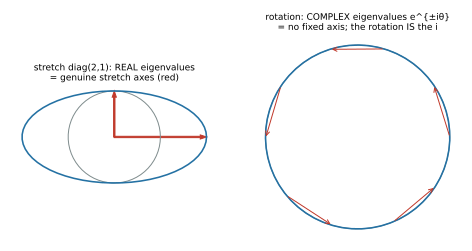
*Figure 7 — What an eigenvalue is. A stretch (left) has real eigenvalues — genuine axes it
pulls along. A rotation (right) has no fixed axis at all; its eigenvalues are complex,
e^{±iθ} — the rotation itself is the i.*

## Chapter 10 — What the Fourier transform really is

Any repeating shape is a **sum of pure rotations** — circles turning at different
speeds. The Fourier transform asks each speed, *"how much of you is in this signal?"*
[Fourier 1822]. A square wave, for example, is Σ 4/(πk)·sin(kt) over odd k; a seven-term
sum already matches it closely (verified: mean-squared error 0.029). (Reading the formula
in plain words: the big Σ just means *add up*; each piece is one spinning circle — sin is
the up-and-down height of a dot going around a circle, *k* is how fast that circle spins,
and 4/(πk) is how big it is. Add the first few circles and the square wave already appears,
as Figure 8 shows.) Each frequency is a
circle spinning at its rate — an *i*-rotation, a breath — and the transform reads off
each circle's strength. Fourier ceases to be an intimidating integral and becomes *which
spinning circles, added together, build this wave, and how strong is each* [the "epicycle"
picture is classical and pedagogically standard].

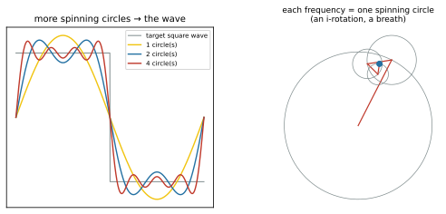
*Figure 8 — The Fourier transform. Add more spinning circles (left) and their sum
approaches the square wave; each frequency is one circle turning at its rate (right) — an
i-rotation, a breath. The transform reads off each circle's strength.*

## Chapter 11 — What a group really is

A group is the set of **moves that leave a shape looking the same** — its symmetries
[Klein's Erlangen program made this the organizing idea of geometry; Klein 1872]. The
integer-shapes give a *ladder of groups*: the point (trivial), the segment (a single
flip, ℤ₂), the triangle (three rotations and three flips, the dihedral group D₃), the
square (D₄), the cube (the octahedral group). The axioms become visible: **closure** (a
move after a move is a move), **identity** (do nothing), **inverse** (undo). The
accompanying script verifies D₃ as the six symmetries of the triangle, closed, with
identity and inverses. Abstract algebra ceases to be abstract: *a group is the moves of
a shape, and the shapes are the ones already met as the integers.*

---

# PART FOUR — LESSONS FROM THE COMBINATORIAL FRONTIER
### *Four further lessons, drawn from research combinatorics, that pass the same bar*

*These lessons come from the author's research canon. Only the self-contained,
verifiable combinatorial results appear here; the canon's speculative bridges to
physics are research frontier, not curriculum, and are deliberately excluded (see the
note closing this part).*

## Chapter 12 — What a prime *is*: the first number that catches you

Walk 1, 2, 3, … and ask of each: *does it share a factor with N?* For a square-free N,
**the first that does is N's smallest prime factor** (verified: N=15→3, N=35→5, N=77→7,
N=30→2). Coprimality is "no shared factor"; a prime is *the first thing that catches
you.* This gives an operational feel for primality that complements Chapter 6's density
picture [the result is elementary; it formalizes the sieve intuition of Eratosthenes].

## Chapter 13 — Structure can be built: magic squares by a walking rule

A magic square need not be found; it can be *built* by a simple repeatable move. The
Siamese method — place 1, step up-and-right, wrap around the edges, and drop down one
when blocked — constructs a magic square for **every odd order** (verified: the Lo Shu
3×3 sums to 15 on every line; the 5×5 to 65) [the method is classical; the general odd-n
construction is standard, with the ancient Lo Shu as its n=3 case, Swetz 2008]. The
lesson: *deep structure can emerge from a small rule, mechanically applied* — a first,
concrete encounter with the idea that generation and structure are the same thing seen
from two sides.

## Chapter 14 — Why algebra's dimensions double

**The plain idea.** Every time you add one new independent direction to build with, the
number of pieces the algebra needs *doubles* — 1, then 2, then 4, 8, 16, … — because each
new direction can be either included or not, on top of every combination you already had
(the same reason two coins give 4 outcomes and three coins give 8). This is the *counting
lift* of §1.1b grown up into algebra: adding one gumdrop doubled the pieces because it
offered a yes/no to everything, and adding one Clifford generator doubles the dimension for
the very same reason — one more in-or-out choice. Doubling over and over
is why these sizes are always powers of two. In symbols:

The dimension of the n-fold tensor of a four-dimensional space is 4ⁿ = 2^{2n}, which is
exactly the dimension of the Clifford algebra Cl(2n) (verified for n = 1…5). The
picture: **each new generator *doubles* the algebra** — which is why Clifford (and
exterior) algebra dimensions are always powers of two, and why the cube, with its 2³ = 8
vertices, is the Clifford algebra of three-dimensional space [Clifford 1878; Lounesto
2001]. This generalizes the two-shadow cube of §1.5 into a rule: *dimension doubles with
each independent direction.*

> **Note on what is excluded.** The research canon from which Chapters 12–14 are drawn
> contains many further results connecting a discrete algebraic substrate to Lie
> algebras, grand-unified gauge groups, and open problems in physics. Those are
> *research frontier* — some proven as self-contained algebra, others explicitly tagged
> as structural analogies or open — and they are **not** part of this curriculum,
> because a curriculum teaches the *shared language* of mathematics, not a framework's
> private results. The discipline that admits Chapters 12–14 (self-contained, verified,
> teaches a concept students meet elsewhere) is the same discipline that excludes the
> physics bridges. Keeping the two apart is essential to the honesty of the whole.

---

# PART FIVE — THE MODEL AS A WHOLE

## Chapter 15 — Why it is one model, not sixteen

The power of the vocabulary is that the **same six primitives taught all sixteen
lessons**, and that the lessons connect *through* the primitives:

- The **count-versus-measure** seam is √2's irrationality (Ch. 8), *and* why the
  discrete integers cast continuous shadows (Ch. 1), *and* the deep reason the hardest
  open problems sit where whole structure meets continuous measure.
- The **imaginary axis** *i* is quantum phase (Ch. 7), *and* the complex eigenvalue
  (Ch. 9), *and* the Fourier rotation (Ch. 10), *and* the half-turn π (Ch. 5.1) — one
  idea, four courses.
- The **shapes** are the Platonic solids (Ch. 3) *and* the groups (Ch. 11) — the same
  objects as forms and as their symmetries.
- The **breath** is *e* (Ch. 4), its inverse the logarithm and its instant the derivative
  (Ch. 4.1–4.2), *and* prime thinning (Ch. 6, the sieve as repeated closing) — growth,
  decay, and the measure of growth as one motion.
- The **golden ratio** φ is the pentagon's diagonal (Ch. 3.1, the break of §1.2) *and* the
  rate of self-similar growth (the breath once more) — the same number as a shape and as
  a motion.
- **Building by a rule** is magic squares (Ch. 13) *and* dimension-doubling (Ch. 14) —
  structure as generated, not found.

A student who learns these lessons has not learned sixteen things but **one connected
picture seen from sixteen angles** — which is the whole aim: a model that can be held in
one mind, so that mathematics is experienced as a structure rather than a stack.

## Chapter 16 — Honest failures (pictures tried and discarded)

Kept so the vocabulary stays trustworthy:
- **"The recurring 1/3 is a universal residue of subtraction."** False. 1/(N−1) = 1/3
  *only at N = 4*. The 1/3 is the tetrahedron's signature; taught correctly as *4 − 1 = 3*.
- **"The breath produces physical energy or the fundamental constants."** False. The
  breath is *structural* growth; it is never energy from nothing and never a physical
  magnitude. The picture teaches the *shape* of self-proportional growth, nothing more.
- **"The golden ratio is everywhere in nature and art."** Overstated. φ is forced only
  where growth is *self-similar and additive* (§3.1) — phyllotaxis, the pentagon, the
  Fibonacci recursion. Many celebrated sightings (the Parthenon, the "ideal" face, most
  spirals labelled "golden") are retrofitted or simply wrong [Markowsky 1992]. The picture
  is kept for the mechanism, not the mystique.
- **"Adding a point doubles the edges (or the faces)."** False in general, and a tempting
  trap from the very first lift (§1.1b), where the sticks *do* double (3 → 6) and the faces
  quadruple (1 → 4). Those multipliers shrink at every later step (edges next go ×1⅔). The
  count that doubles *every* time is the **total** number of sub-pieces, 2ᴺ — the yes/no on
  the new point. Taught correctly as *the whole doubles, not any one slice of it.*
- **"Every physical or computational structure is literally the same geometry."** Not a
  teaching claim. The convergence of structure across domains — for instance, the
  observed alignment of representations in independently trained neural networks [Huh et
  al. 2024] — is real *evidence that shared structure exists*, and it motivates the
  search; but the specific decoding must be earned lesson by lesson, and this book teaches
  only the pictures that have been checked.

## Chapter 17 — How to test this book

The whole book rests on a claim about *teaching*, and a claim about teaching is
falsifiable by teaching. This chapter states the test concretely enough to run.

**17.1 The three predictions.**
- **Faster connected models.** Students taught with the shape/rotation vocabulary build a
  *connected* model — one where they can see that eigenvalues, Fourier, and quantum phase
  are one idea — faster than students taught the standard formalism-first sequence.
- **Fewer later errors.** Students taught the count-versus-measure picture make fewer of
  the classic mistakes about the reals, limits, and the continuum.
- **Better transfer.** Students who hold the vocabulary solve *novel* problems — ones not
  drilled — more often, because they can reach for the right picture.

**17.2 A concrete A/B protocol.** The cleanest single test isolates one lesson.
- *Design.* Randomize a pool of students (ideally ≥ 60 per arm for a medium effect at
  80% power; a classroom pilot of 20–30 per arm is worth running first) into two arms.
  **Arm A (treatment)** is taught, say, the eigenvalue as *the axis a transformation spins
  around, real when it stretches and complex when it turns* (Ch. 9, with Figure 7). **Arm
  B (control)** is taught the same content in the standard order — characteristic
  polynomial, roots, eigenvectors — by the same instructor, in the same time. Only the
  *picture* differs, so the picture is what is under test.
- *Blinding and fairness.* The two lessons are matched for length, worked examples, and
  practice count; a second instructor delivers a replication to remove instructor effects;
  graders of the outcome tests do not know which arm a script came from.
- *Measures.* (1) An **immediate** comprehension quiz. (2) A **retention** quiz at two
  weeks, un-announced. (3) A **transfer** item never taught in either arm — e.g. "here is a
  shear matrix; does it have a real stretch-axis? explain" — scored for whether the student
  reasons with axes/rotation at all. (4) A short **connection** prompt: "what, if anything,
  does this have to do with the Fourier transform?", scored blind for whether the student
  sees the shared rotation.
- *Analysis.* Pre-register the primary outcome (transfer score at two weeks) and the
  direction of effect before collecting data. Compare arms with a simple two-sample test;
  report the effect size and its interval, not only a p-value; publish the null if it is
  null. One clean null on the primary outcome falsifies the lesson's pedagogical claim —
  and that is a result, not a failure of the study.
- *Replication across lessons.* Repeat the design for √2 (Ch. 8), the group (Ch. 11), and
  one *extension* lesson (the logarithm, Ch. 4.1). The book's stronger claim — that the
  *vocabulary* transfers, not just one lucky picture — is tested only if several
  independent lessons move the same way.

A **ready-to-run kit** implementing this protocol is in [`study/`](study/): the
pre-registration, the two matched lesson scripts (treatment and control), the four
assessment instruments with scoring rubrics, a power analysis (≈ 64 per arm for
*d* = 0.5 at 80% power), and the analysis script — the last already tested on
simulated data, so the pipeline is verified before any student is taught. It is a
kit, not a result: until a cohort is run, the pedagogy is a hypothesis with an
apparatus, and the book says so.

**17.3 The honest edge.** Some advanced structure — high-dimensional phenomena, genuinely
non-geometric algebra — may have *no* faithful low-dimensional picture, and the protocol
above will find it as a lesson whose treatment arm does *not* beat control. Locating that
edge is part of the work; its existence is not a defect but a boundary honestly drawn, and
recorded (Chapter 16) rather than hidden. A pedagogy that cannot fail anywhere is not being
tested; this one is built to say where it stops.

## Conclusion — The shape of understanding

Sixteen of the deepest and hardest-to-teach ideas in mathematics — the Platonic solids,
*e*, the logarithm, the derivative, the radian, π, the rarity of primes, the complexity of
quantum mechanics, the irrationality of √2, the eigenvalue, the Fourier transform, the
group, the operational meaning of primality, the construction of magic squares, the
doubling of algebraic dimension, and the golden ratio — have been taught here with one
small visual vocabulary: shapes that build by
dimension, a rotation that is an imaginary axis, a growth that is a breath, a cube with
two shadows, and the seam where counting fails to measure. Each picture was checked
against the real mathematics; each is visual; each connects to the others, so that the
learner acquires one model seen from many sides rather than many disconnected facts. The
pictures are kept honest by a discipline of checking and a record of discarded failures,
so that following them leads to true mathematics rather than comfortable error.

Whether this makes the deep studies easier to hold in one mind is a question about
teaching, and it is answerable by teaching. It is worth asking, because the absence of a
shared, true, visual model has been the oldest obstacle in mathematics education, and a
shared, true, visual model — from Descartes' plane to Argand's diagram to Feynman's
arrows — has each time been rare, and each time been worth more than the sum of the facts
it organized.

## Coda — Increasingly round, never measurably round

There is a way to say the aim of this book in seven words, and it is borrowed and then
extended. In proving the Poincaré conjecture, Grigori Perelman completed a program, due
to Richard Hamilton, in which a manifold's geometry is evolved by **Ricci flow** so that
its curvature smooths and homogenizes — so that the shape becomes, in the natural phrase,
*increasingly round* [Hamilton 1982; Perelman 2002–2003]. The round is the attractor;
what can become round does; the three-sphere is what remains. This is the same motion
that appears throughout mathematics and its applications wherever structure, left to
evolve under a natural rule, collapses onto a simpler and more symmetric form.

But the *perfect* round — the exact sphere, the completed limit — is a direction, not a
place one occupies. It is approached and never reached, in the way that the speed of
light is approached by anything with mass and never attained, and in the way that the
diagonal of a unit square is approached by ratios of whole numbers and never measured by
one (Chapter 8). The perfectly round shape is, moreover, the one shape that has **no
edge** — no vertex, no face, no seam — and it is exactly this edgelessness that makes it
unmeasurable, for measurement requires an edge to measure from and a distinction to
measure between, and on the perfect sphere every point is identical to every other. The
perfect round is unmeasurable *because* it is perfectly without edge.

This is the same nature the void wears in Chapter 1. The centre — the point nearest to
all points at once (§1.6b) — cannot itself be measured, because it is the origin *from
which* measurement is taken, not an object measured against something else. The fullest
point and the edgeless limit are two faces of one thing: the position that is equally
near to everything, and therefore has nothing to be distinguished *from*. Understanding
flows toward that position — near to all of it, distinguished from none of it — and never
occupies it, because to occupy it would be to become the centre from which all the rest is
seen, which is a direction the mind travels and not a place it arrives.

This is the shape of understanding that the book is named for. A good curriculum makes
mathematics **increasingly round** — the pictures smoother, the connections more uniform,
the whole more nearly held in a single mind. And the *complete* understanding, the seeing
of the object whole, is the perfect round toward which the teaching flows and which it
never occupies — because to see the object whole would be to stand on the edgeless limit,
and the edgeless limit is, by its nature, just past measure. This is not a limitation to
be regretted. It is the reason the flow is worth undertaking: one hands a learner the
*direction*, not the destination, because the destination is real and unreachable, as
every genuine limit is. Always rounder; never round. That is what it is to understand.

---

# BACK MATTER

## Appendix A — The verification scripts
`verify_forced_chain.py` (the geometric core: simplices, the tetrahedral 1/3, the cube
as Cl(3), the two shadows) and `curriculum_checks.py` (each lesson, in the book's order:
the equidistance ladder and the omni-adjacent void, the crystallographic restriction, the
two-shadow cube, the Schläfli count, *e* as self-proportional growth, the radian, the
sieve/Mertens density with the units-versus-primes distinction, Euler's *e^{iπ} = −1*, the
√2 parity descent, the eigenvalue axis/rotation split, the Fourier square-wave synthesis,
the D₃ symmetry count, the First-G law, the Siamese magic square, the dimension-doubling
identity, the lift-as-doubling (§1.1b) and the cube = Cl(3) grade split 1+3+3+1 with its
rotating bivectors (§2.2), and the extension lessons — the logarithm, π, the derivative, the
golden ratio with the pentagon, and the ℝ→ℂ→ℍ rotation tower). Every asserted mathematical fact in the book is
reproduced by running these, and `curriculum_checks.py` prints `ALL LESSON CHECKS PASS`
only after its final assertion succeeds.

## References

- J.-R. Argand, *Essai sur une manière de représenter les quantités imaginaires dans les
  constructions géométriques* (Paris, 1806); C. Wessel (1799).
- W. Barlow, "Über die geometrischen Eigenschaften homogener starrer Strukturen,"
  *Z. Kristallogr.* 23, 1 (1894). [crystallographic restriction]
- M. Born, "Zur Quantenmechanik der Stoßvorgänge," *Z. Phys.* 37, 863 (1926). [Born rule]
- W. K. Clifford, "Applications of Grassmann's extensive algebra," *Amer. J. Math.* 1,
  350 (1878).
- H. S. M. Coxeter, *Regular Polytopes*, 3rd ed. (Dover, 1973). [simplices, stella
  octangula, Platonic solids]
- R. Descartes, *La Géométrie* (1637).
- Euclid, *Elements*, Book XIII (c. 300 BCE).
- L. Euler, *Introductio in analysin infinitorum* (1748). [e]
- E. S. Fedorov, "Symmetry of regular systems of figures" (1891). [the 17 plane groups]
- R. P. Feynman, "Space-time approach to quantum electrodynamics," *Phys. Rev.* 76, 769
  (1949); *The Feynman Lectures on Physics* (Addison-Wesley, 1964); *QED* (Princeton,
  1985).
- J. Fourier, *Théorie analytique de la chaleur* (1822).
- K. von Fritz, "The discovery of incommensurability by Hippasus of Metapontum," *Ann.
  Math.* 46, 242 (1945).
- J. Hadamard (1896); C.-J. de la Vallée Poussin (1896). [Prime Number Theorem]
- R. S. Hamilton, "Three-manifolds with positive Ricci curvature," *J. Diff. Geom.* 17,
  255 (1982). [Ricci flow]
- T. L. Heath, *A History of Greek Mathematics* (Oxford, 1921). [Pythagorean
  incommensurability]
- M. Huh, B. Cheung, T. Wang, P. Isola, "The Platonic Representation Hypothesis,"
  *Proc. ICML* (2024). [convergence of learned representations]
- J. Kepler, *Harmonices Mundi* (1619). [stella octangula]
- F. Klein, "Vergleichende Betrachtungen über neuere geometrische Forschungen"
  (Erlangen program, 1872).
- P. Lounesto, *Clifford Algebras and Spinors*, 2nd ed. (Cambridge, 2001).
- G. Markowsky, "Misconceptions about the Golden Ratio," *College Math. J.* 23, 2 (1992).
- F. Mertens, "Ein Beitrag zur analytischen Zahlentheorie," *J. reine angew. Math.* 78,
  46 (1874).
- L. Pauling, *The Nature of the Chemical Bond*, 3rd ed. (Cornell, 1960). [tetrahedral
  bond angle]
- G. Perelman, "The entropy formula for the Ricci flow and its geometric applications"
  (2002) and "Ricci flow with surgery on three-manifolds" (2003), arXiv:math/0211159,
  math/0303109. [Poincaré conjecture; increasingly round]
- G. Strang, *Introduction to Linear Algebra*, 5th ed. (Wellesley-Cambridge, 2016).
  [geometric eigenvalues]
- F. J. Swetz, *Legacy of the Luoshu*, 2nd ed. (A K Peters, 2008). [magic squares, Lo Shu]

---

*Manuscript. Chapters 1–14 carry the verified core; Part Two's elegant chapters now include
worked figures, extension lessons (the logarithm, the derivative, π, the golden ratio),
exercises, and misconception boxes, and Part Five's testing chapter (17) gives a concrete
A/B protocol. Every mathematical assertion is reproduced by the appendix scripts
(`verify_forced_chain.py`, `curriculum_checks.py` — the latter prints ALL LESSON CHECKS
PASS), and the load-bearing lessons are drawn in `figures/` by `make_figures.py`.
Increasingly round; never measurably round.*
